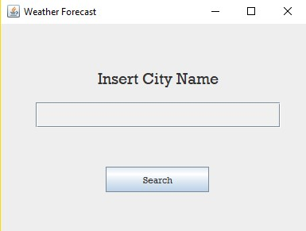
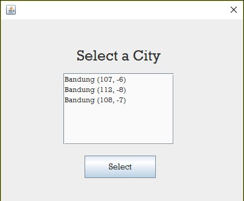
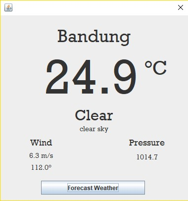
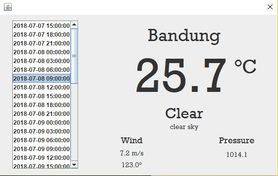

# Weather Forecast App
## Open Weather Map API
Based on wikipedia definition, API or Application Programming Interface is
> A set of subroutine definitions, protocols, and tools for building application software.

API helps software developer to gather the data from certain application/technology. Usually, the data format to communicate through API is a kind of semistructured format such as XML or JSON.
Open Weather Map API is an API that provides weather data. It can provides several data such as
- current weather data
- historical weather data
- daily forecast
- weather map layer
- UV index
- etc.

# Package Structure
Using MVC design pattern approach, I pack the classes in several packages.
## weather.forecast.main
This is the main package of this app. It contains main class and other packages that i will explain afterwards.
## weather.forecast.MainMenu
This is the package that contains several classes which is representing view and controller in the very first when app is executed.
## weather.forecast.DetailedCity
This package contains several classes which is representating view and controller of detailed information of specific city such as temperature, weather, wind, etc.
## weather.forecast.model
This package contains classes which is used for gathering data from Open Weather Map API and send it back to views or controller

# Progress Checklist
## weather.forecast.main
- [x] class MainMenuFrame
- [x] class SearchClickListener
- [x] class SelectCityListener
- [x] class ForecastWeatherClickListener
## weather.forecast.MainMenu
- [x] class SearchPanel
- [x] class CityResultDialog
## weather.forecast.DetailedCity
- [x] class WeatherDetailPanel
- [x] class CurrentWeatherDialog
- [x] class DateSelectionPanel
- [x] class ForecastWeatherDialog
## weather.forecast.model
- [x] class WeatherData

# JDepend Analysis Result
It can be found in `jdepend` directory

# How To Compile and Run the Application
Clone the repo and go to 'dist' directory
```
git clone https://github.com/priagungs/weather-forecast-java-swing.git
cd weather-forecast-java-swing
```
Open NetBeans IDE, open project by selecting `weather-forecast-java-swing` folder and press `Shift + F11` to compile the project.
Back to terminal, go to dist folder and run the app by inserting this command
```
cd dist
java -jar weather-forecast.jar
```

# Screenshot





